<p align="center">
  <h1 align="center">Real-Time IoT Data Streaming Platform</h1>
  <p align="center">
    <strong>Wind Turbine Sensor Data | Kafka + Spark Structured Streaming + TimescaleDB</strong>
  </p>
  <p align="center">
    <a href="#architecture-overview">Architecture</a> &middot;
    <a href="#data-pipeline-layers">Pipeline Layers</a> &middot;
    <a href="#quick-start">Quick Start</a> &middot;
    <a href="#screenshots">Screenshots</a> &middot;
    <a href="docs/architecture.md">Docs</a>
  </p>
</p>

<p align="center">
  
  
  
  
  
  
  
  
  
  
</p>

---

A **production-grade real-time data engineering platform** that simulates wind turbine IoT sensor telemetry and processes it through a complete streaming pipeline. The system ingests events via Apache Kafka, transforms data through Bronze/Silver/Gold lakehouse layers using PySpark Structured Streaming, stores results in MinIO (S3-compatible data lake) and TimescaleDB (time-series analytics), and provides real-time observability through Grafana dashboards and Prometheus metrics.

Built to demonstrate end-to-end proficiency in **real-time data streaming**, **distributed systems**, **event-driven architecture**, **data lake design**, and **production monitoring**.

## Architecture Overview

```
┌─────────────────┐     Avro/Schema Registry     ┌──────────────────┐
│  IoT Simulator  │ ──────────────────────────▶  │   Apache Kafka   │
│  (12 Turbines)  │    Idempotent + Snappy       │   (KRaft Mode)   │
└─────────────────┘                               └────────┬─────────┘
                                                           │
                              ┌─────────────────────────────┘
                              │
                    ┌─────────▼──────────┐
                    │  PySpark Structured │
                    │     Streaming       │
                    └──┬──────┬──────┬───┘
                       │      │      │
              ┌────────▼┐ ┌──▼────┐ ┌▼────────┐
              │ BRONZE  │ │SILVER │ │  GOLD    │
              │  (Raw)  │ │(Clean)│ │(Analytics│
              │ Parquet │ │Parquet│ │ + Anomaly│
              └────┬────┘ └──┬────┘ └┬────────┘
                   │         │       │
         ┌─────────┴─────────┴───────┘
         │                   │
   ┌─────▼──────┐    ┌──────▼────────┐
   │   MinIO     │    │  TimescaleDB  │
   │ (S3 Lake)   │    │  (Serving DB) │
   └─────────────┘    └──────┬────────┘
                             │
                      ┌──────▼──────┐
                      │   Grafana    │◀── Prometheus
                      │  Dashboards  │    (Metrics)
                      └─────────────┘
```

> For the detailed architecture with component internals, see [`docs/architecture.md`](docs/architecture.md).

## Technology Stack

| Layer | Technology | Purpose |
|-------|-----------|---------|
| **Ingestion** | Apache Kafka (KRaft) | Distributed event streaming with no ZooKeeper dependency |
| **Schema** | Confluent Schema Registry + Avro | Schema evolution, compact binary serialization |
| **Processing** | PySpark Structured Streaming | Real-time micro-batch ETL with exactly-once semantics |
| **Data Lake** | MinIO (S3-compatible) | Columnar Parquet storage across Bronze/Silver/Gold layers |
| **Serving** | TimescaleDB | PostgreSQL-native hypertables for time-series analytics |
| **Orchestration** | Apache Airflow | Pipeline health monitoring, automated recovery |
| **Metrics** | Prometheus + Custom Exporters | Kafka lag, Spark batch duration, throughput, error rates |
| **Dashboards** | Grafana | Auto-provisioned real-time operational dashboards |
| **Infrastructure** | Docker Compose | 15+ containers with health checks and dependency ordering |

## Data Pipeline Layers

### Bronze Layer — Raw Ingestion
- Kafka messages deserialized and persisted **as-is** (immutable source of truth)
- Partitioned by `event_date` and `turbine_id` for efficient downstream reads
- Stored as Parquet in `s3a://wind-turbine-bronze/`
- Enables full replay and reprocessing from raw events

### Silver Layer — Cleaned & Enriched
- Invalid sensor readings filtered (out-of-range temperature, RPM, vibration)
- Timestamps parsed and normalized to UTC
- Derived metrics computed:
  - **`capacity_factor`** — actual vs. rated power output
  - **`temp_delta_generator`** — generator temperature above ambient
  - **`temp_delta_gearbox`** — gearbox temperature above ambient
  - **`wind_speed_bin`** — categorical wind classification (calm/light/moderate/strong/extreme)
- Stored as Parquet in `s3a://wind-turbine-silver/`

### Gold Layer — Aggregated Analytics
- **Hourly Power Aggregation**: avg/max/min power, total energy (kWh), efficiency, capacity factor per turbine per hour
- **Anomaly Detection**: real-time rule-based detection with severity classification:
  - Generator temperature > 85°C → `CRITICAL`
  - Gearbox temperature > 75°C → `WARNING`
  - Vibration > 1.5 mm/s → `WARNING`
  - Zero power output during viable wind conditions → `CRITICAL`
- Dual-write to both Parquet (MinIO) and TimescaleDB for analytics serving

## Repository Structure

```
├── simulator/                  # IoT telemetry simulator
│   ├── turbine_simulator.py    # Physics-based turbine model (cubic power curve)
│   └── main.py                 # Entry point — simulator + Kafka producer
├── producer/
│   └── kafka_producer.py       # Avro-serializing idempotent Kafka producer
├── schemas/
│   ├── turbine_telemetry.avsc  # Avro schema definition (12 telemetry fields)
│   └── registry.py             # Schema Registry client helpers
├── spark/
│   ├── streaming_pipeline.py   # Main pipeline orchestrator (4 streaming queries)
│   ├── jobs/
│   │   ├── bronze_layer.py     # Raw ingestion from Kafka → Parquet
│   │   ├── silver_layer.py     # Data quality filters + enrichment
│   │   ├── gold_layer.py       # Hourly aggregations + anomaly detection
│   │   └── timescaledb_sink.py # JDBC sink configuration for TimescaleDB
│   └── utils/
│       ├── spark_session.py    # SparkSession factory with S3A/MinIO config
│       └── schema.py           # Spark SQL schema definitions
├── database/
│   ├── migrations/
│   │   └── 001_init_schema.sql # Hypertables, continuous aggregates, retention policies
│   └── utils/
│       └── connection.py       # ThreadedConnectionPool management
├── airflow/
│   └── dags/
│       └── wind_turbine_pipeline_dag.py  # Health checks, lag monitoring, auto-recovery
├── monitoring/
│   ├── prometheus/
│   │   └── prometheus.yml      # Scrape targets (Kafka, MinIO, TimescaleDB, pipeline)
│   ├── grafana/
│   │   ├── dashboards/         # Pre-built dashboard JSON (auto-provisioned)
│   │   └── provisioning/       # Datasource + dashboard provisioning configs
│   └── exporters/
│       └── pipeline_metrics.py # Custom Prometheus exporter (counters, gauges, histograms)
├── docker/
│   ├── docker-compose.yml      # Full 15-service infrastructure stack
│   ├── Dockerfile.simulator    # Simulator container
│   ├── Dockerfile.spark        # Spark job container
│   └── Dockerfile.pipeline-exporter  # Metrics exporter container
├── configs/
│   ├── __init__.py             # Config loader with ${VAR:-default} env var resolution
│   ├── pipeline.yaml           # Central pipeline configuration
│   └── logging.yaml            # Structured JSON logging config
├── tests/
│   └── unit/
│       ├── test_simulator.py   # Power curve, efficiency, event generation tests
│       ├── test_config.py      # Config loading + env var resolution tests
│       └── test_schema.py      # Avro schema validation tests
├── docs/
│   ├── architecture.md         # Detailed system architecture
│   ├── pipeline-flow.md        # Data flow through Bronze → Silver → Gold
│   ├── system-design.md        # Design decisions and trade-offs
│   └── images/                 # Screenshots and diagrams
├── legacy/                     # Early prototype scripts (superseded)
├── .env.example                # Environment variable template
├── requirements.txt            # Python dependencies
└── requirements-spark.txt      # Spark container dependencies
```

## Screenshots

### Kafka — Topic Inspection & Message Flow
<p align="center">
  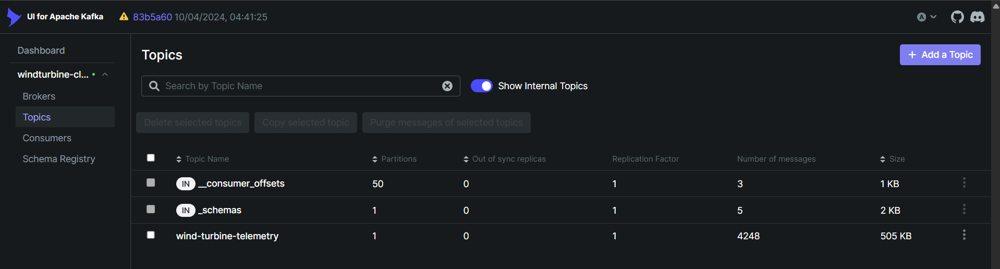
  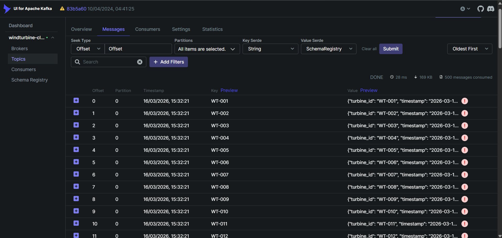
</p>

### Spark Structured Streaming — Active Jobs
<p align="center">
  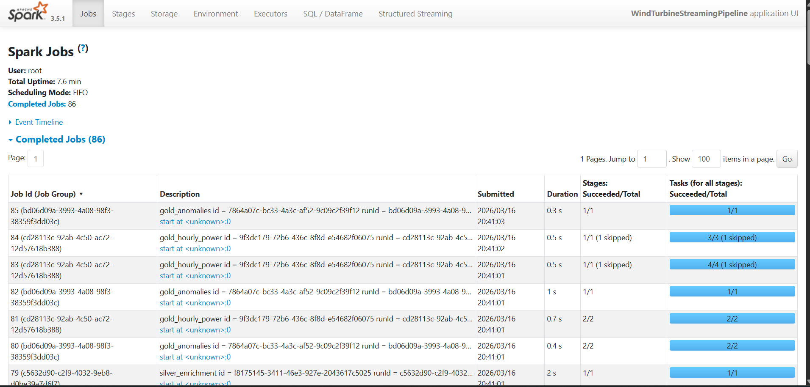
  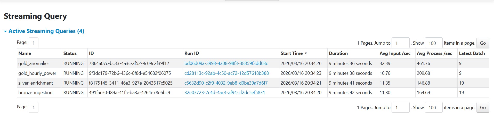
</p>

### MinIO Data Lake — Bronze / Silver / Gold Layers
<p align="center">
  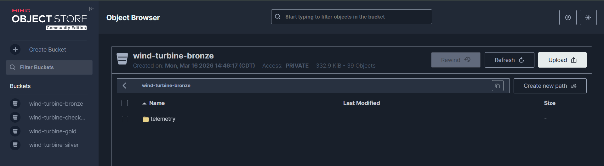
  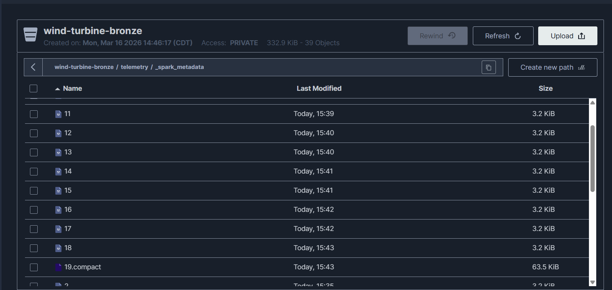
  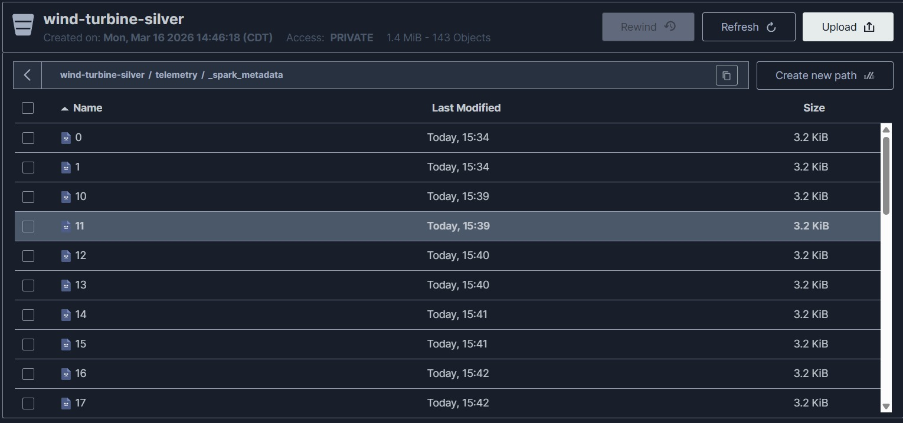
</p>
<p align="center">
  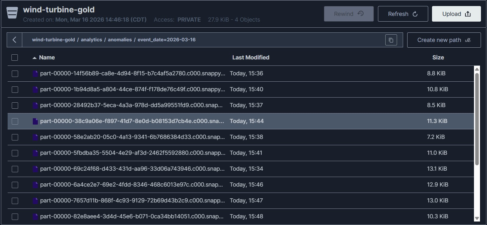
</p>

### TimescaleDB — Hypertables & Time-Series Data
<p align="center">
  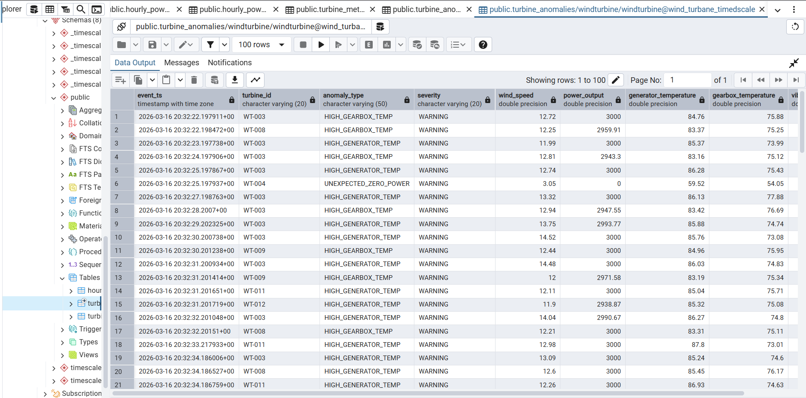
</p>

### Grafana — Real-Time Operational Dashboards
<p align="center">
  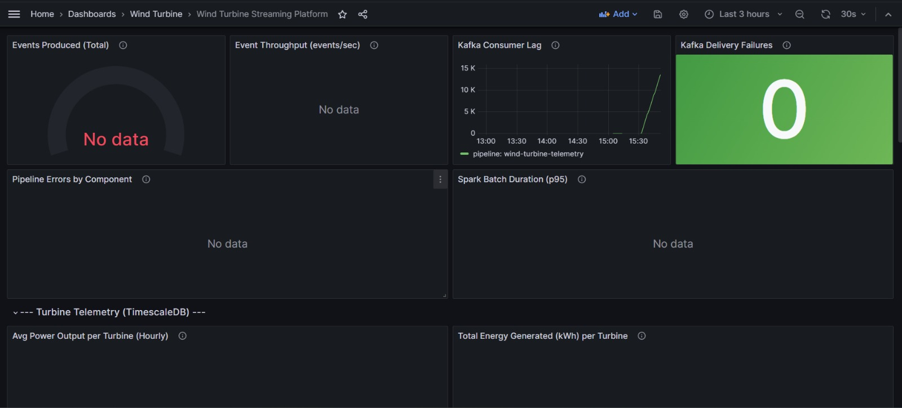
  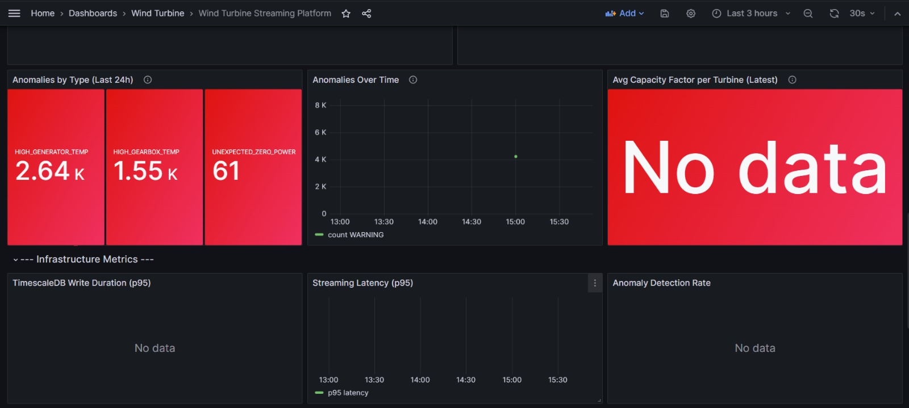
  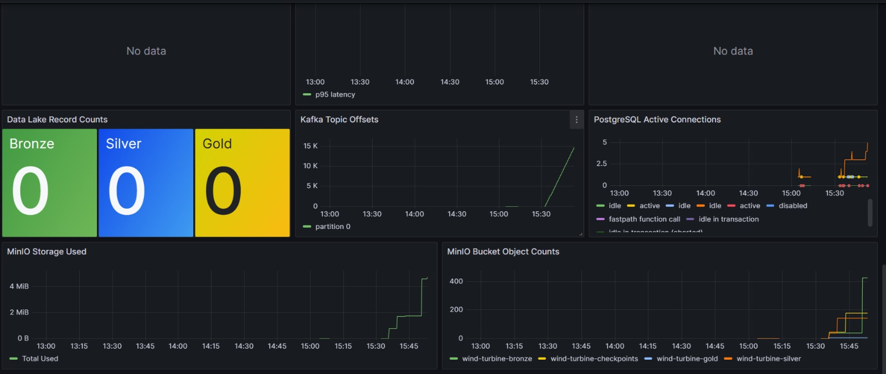
</p>

## Quick Start

### Prerequisites

- **Docker** and **Docker Compose** v2+
- **8 GB+ RAM** available for containers

### 1. Clone and Configure

```bash
git clone https://github.com/madhav-nanda/kafka-timescaledb-iot-streaming-pipeline.git
cd kafka-timescaledb-iot-streaming-pipeline

cp .env.example .env
# Edit .env with your desired passwords (defaults work for local development)
```

### 2. Start the Infrastructure

```bash
cd docker
docker compose up -d
```

This launches **15 services**: Kafka (KRaft), Schema Registry, MinIO, TimescaleDB, Spark, Simulator, Prometheus, Grafana, Airflow, Kafka UI, and supporting init/exporter containers.

### 3. Verify the Pipeline

```bash
# Check all services are healthy
docker compose ps

# Watch Spark streaming logs
docker compose logs -f spark-app

# Watch simulator producing events
docker compose logs -f simulator
```

### 4. Access the Dashboards

| Service | URL | Credentials |
|---------|-----|-------------|
| **Kafka UI** | [localhost:8080](http://localhost:8080) | — |
| **Spark UI** | [localhost:4040](http://localhost:4040) | — |
| **MinIO Console** | [localhost:9001](http://localhost:9001) | `minioadmin` / `minioadmin123` |
| **Grafana** | [localhost:3000](http://localhost:3000) | `admin` / `admin` |
| **Prometheus** | [localhost:9090](http://localhost:9090) | — |
| **Airflow** | [localhost:8082](http://localhost:8082) | `admin` / `admin` |

### 5. Common Operations

```bash
# Stop the simulator (pipeline continues processing buffered events)
docker compose stop simulator

# Restart the Spark streaming job
docker compose restart spark-app

# View real-time Kafka consumer lag
docker compose logs pipeline-exporter

# Tear down everything (preserves volumes)
docker compose down

# Full reset (destroys all data)
docker compose down -v
```

## Running Tests

```bash
pip install -r requirements.txt
pytest tests/ -v --cov=simulator --cov=configs --cov=schemas
```

## Monitoring & Observability

The platform exports metrics via **Prometheus** with three custom exporters:

| Metric | Type | Description |
|--------|------|-------------|
| `events_produced_total` | Counter | Total events produced to Kafka |
| `kafka_consumer_lag` | Gauge | Messages behind per partition |
| `spark_batch_duration_seconds` | Histogram | Processing time per micro-batch |
| `anomalies_detected_total` | Counter | Flagged events by type and severity |
| `db_write_duration_seconds` | Histogram | TimescaleDB batch write latency |
| `bronze_record_count` / `silver_record_count` / `gold_record_count` | Gauge | Records per layer |

Pre-built **Grafana dashboards** are auto-provisioned on startup — no manual configuration needed.

## Configuration

All pipeline configuration is centralized in [`configs/pipeline.yaml`](configs/pipeline.yaml) with environment variable override support:

```yaml
kafka:
  bootstrap_servers: ${KAFKA_BOOTSTRAP_SERVERS:-kafka:29092}
  topic: wind-turbine-telemetry

simulator:
  num_turbines: 12
  wind_speed:
    cut_in: 3      # m/s — minimum for power generation
    rated: 12      # m/s — rated wind speed
    cut_out: 25    # m/s — emergency shutdown threshold
```

See [`.env.example`](.env.example) for all available environment variables.

## Design Decisions

| Decision | Rationale |
|----------|-----------|
| **Kafka KRaft mode** | Eliminates ZooKeeper dependency, simplifies operations |
| **Avro + Schema Registry** | Schema evolution support, compact binary format, contract enforcement |
| **4 independent Kafka consumers** | Each layer reads directly from Kafka (no file-source chaining), enabling independent scaling |
| **MinIO over cloud S3** | Local development without cloud dependency, identical S3A API |
| **Parquet columnar format** | Optimized for analytical queries, efficient compression |
| **TimescaleDB hypertables** | Native PostgreSQL with automatic time-based partitioning, continuous aggregates |
| **`foreachBatch` sink** | Enables dual-write (Parquet + JDBC) from Spark Structured Streaming |
| **Watermarking** | Handles late-arriving data with configurable delay windows |
| **Continuous aggregates** | `fleet_daily_summary` materialized view refreshes automatically for dashboard queries |

## Future Roadmap

- [ ] **Real-time alerting** — PagerDuty/Slack integration for critical anomalies
- [ ] **ML-based anomaly detection** — Replace rule-based detection with trained models
- [ ] **Kubernetes deployment** — Helm charts for production cluster deployment
- [ ] **Streaming feature store** — Real-time feature computation for ML pipelines
- [ ] **Schema evolution testing** — Automated compatibility checks in CI/CD
- [ ] **Backpressure handling** — Dynamic rate limiting under load
- [ ] **Multi-cluster Kafka** — MirrorMaker 2 for cross-datacenter replication

## License

This project is available under the [MIT License](LICENSE).
